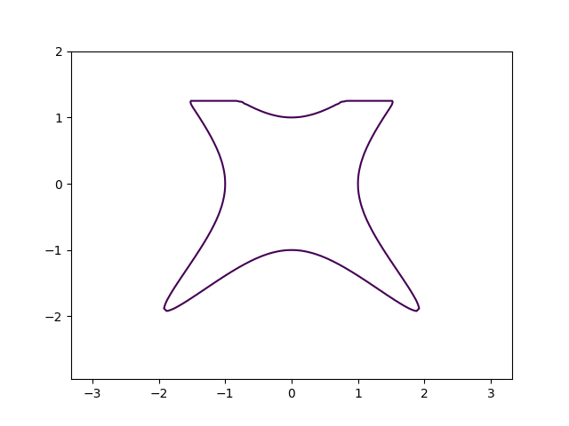
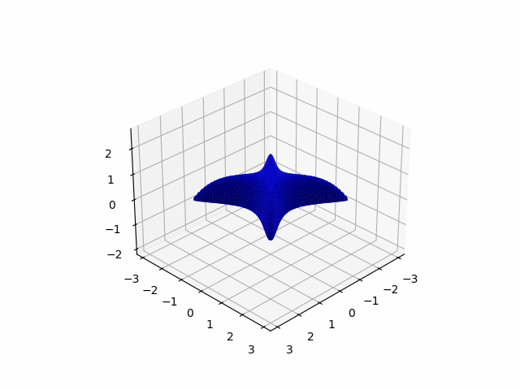

# Minimal outer ellipsoid
Given a basic semi-algebraic set (namely a set defined by polynomial inequalities and equalities) $\mathcal{K} = \{x |p_i(x)\le 0, i=0,...,N, q_j(x)=0, j=0,...,M\}$ (where $p_i(x), q_j(x)$ are polynomial functions of $x$), we aim at finding the minimal outer ellipsoid that covers this basic semi-algebraic set $\mathcal{K}$ through convex optimization.

For example, here we show the minimal outer ellipsoid that covers the inner shape (black)

$$ x_0^4 + x_1^4 - 1.925x_0^2x_1^2 \le 1, x_1 \le 1.25 $$



and here is an example in 3D that our ellipsoid (green) covers the inner shape (blue)

$$ x_0^4 + x_1^4 - 1.925x_0^2x_1^2+x_2\le 1, x_2 \ge 0 $$


## Getting started
You can install the package and the dependencies through
```
pip install -e .
```

### Using Drake
We use [Drake](https://drake.mit.edu) to write our optimization program. If you are unfamiliar with Drake, you can checkout its [tutorials](https://deepnote.com/workspace/Drake-0b3b2c53-a7ad-441b-80f8-bf8350752305/project/Tutorials-2b4fc509-aef2-417d-a40d-6071dfed9199/%2Findex.ipynb).

### Examples
You can check the jupyter notebook examples in `examples` folder. For a mathematical explanation on our optimization program, check our [doc](./docs/formulation.pdf)


